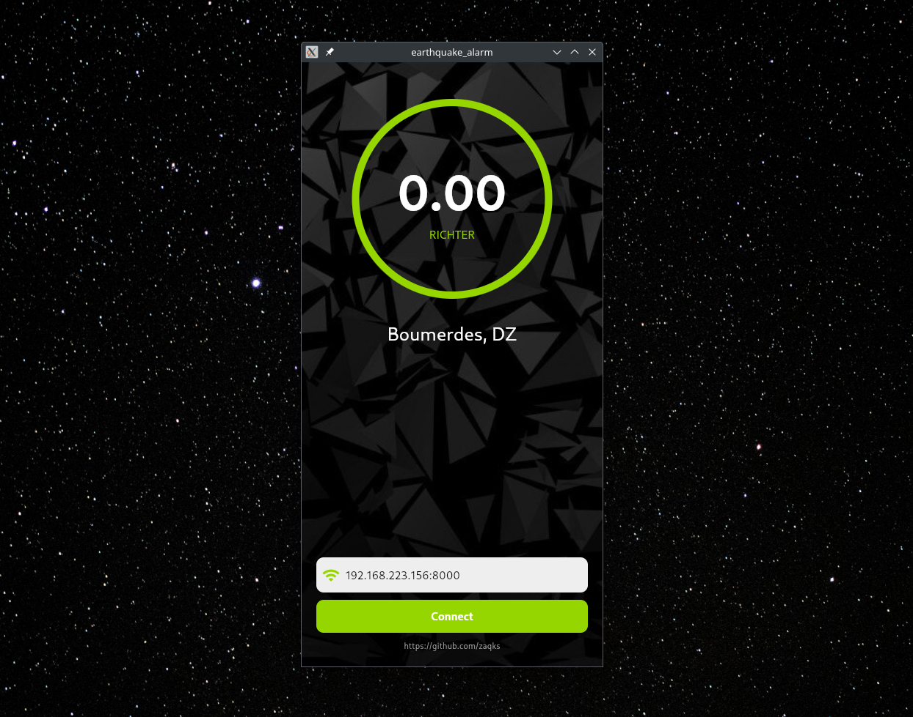

# QuakeGuard App

An app that connects to an <a href="https://github.com/zaqks/QuakeGuard">Earthquake Detection System</a> through it's IP address to notify the user about an incomming disaster in the region he's in (Prototype)

